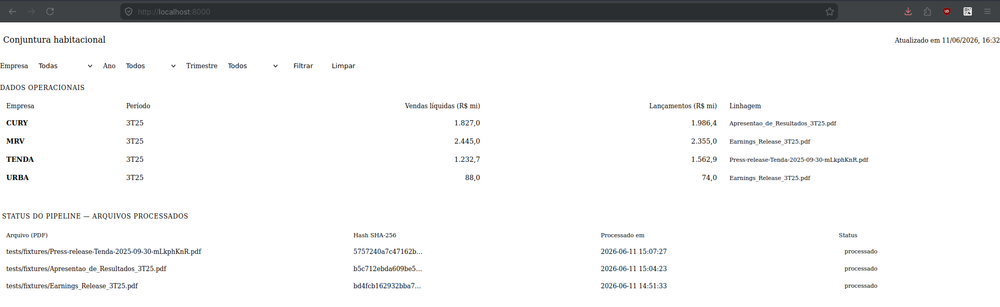
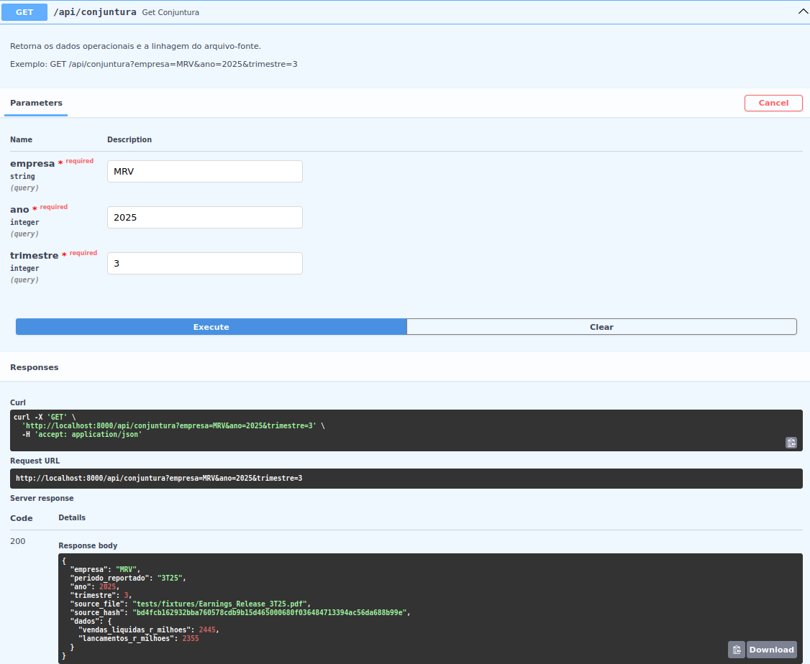

# Pipeline Inteligente de UDA para Relatórios Operacionais do Setor Habitacional

## Visão Geral

Este projeto implementa um pipeline de **Unstructured Data Analysis (UDA)** capaz de monitorar portais de Relações com Investidores (RI), detectar automaticamente novos relatórios operacionais em PDF, extrair métricas relevantes utilizando Large Language Models (LLMs) e disponibilizar os dados estruturados por meio de uma API REST.

A solução foi desenvolvida para atender ao desafio proposto na disciplina, cujo objetivo é transformar documentos financeiros não estruturados em dados estruturados consultáveis, sem depender de regras rígidas de layout.

O pipeline foi projetado para ser resiliente a mudanças visuais nos relatórios das empresas, utilizando compreensão semântica via LLM em vez de coordenadas fixas, expressões regulares complexas ou templates específicos.

---

## Objetivo

Automatizar a geração de uma base estruturada contendo indicadores operacionais de incorporadoras brasileiras a partir de relatórios PDF divulgados em seus portais de Relações com Investidores.

As métricas extraídas incluem:

* Empresa
* Período reportado
* Vendas líquidas (R$ milhões)
* Lançamentos (R$ milhões)

Os dados ficam disponíveis para consulta através de uma API REST, podendo ser utilizados na construção de boletins de conjuntura habitacional.

---

# Arquitetura Geral

```text
Portal RI
    │
    ▼
Scheduler (Polling)
    │
    ▼
Descoberta de PDFs
    │
    ▼
Verificação de Hash
(Idempotência)
    │
    ├── Já processado → Ignora
    │
    ▼
Extração Semântica via LLM
    │
    ▼
Validação Estruturada
(Pydantic + Instructor)
    │
    ▼
Persistência SQLite
    │
    ▼
API REST (FastAPI)
```

## Decisões Arquiteturais
Durante o desenvolvimento foi inicialmente planejada uma arquitetura baseada em Docling para conversão de PDFs em Markdown e posterior análise semântica dos documentos por uma LLM. Entretanto, testes realizados demonstraram limitações práticas para o ambiente disponível:

- O Docling apresentou falhas de parsing em alguns relatórios, omitindo páginas durante a conversão;
    - *Como solução foi sugerido por colegas em sala de aula o uso do Relatório Prévia Operacional*
- O tempo médio de processamento ultrapassava 9 minutos por documento;
- O ambiente de execução possuía apenas 8 GB de RAM e não contava com GPU dedicada;
- O cronograma do projeto não permitia aprofundar a investigação dessas limitações.

Diante desses fatores, optou-se por uma abordagem mais simples e confiável para a versão entregue, priorizando a estabilidade do pipeline e a validação dos conceitos centrais de UDA.

---

# Estrutura do Projeto

```text
projeto-4/
│
├── app/
│   ├── database.py
│   ├── extractor.py
│   ├── pipeline.py
│   ├── scheduler.py
│   ├── models.py
│   ├── main.py
│   └── static/
|      └── index.html
├── docs/
│
├── tests/
│   ├── test_api.py
│   ├── test_extraction.py
│   ├── test_idempotency.py
│   ├── test_scheduler.py
│   └── fixtures/
│
├── requirements.txt
├── manual-pdf-ingest.sh
└── README.md
```

---

# Pipeline Detalhado

## Etapa 1 — Monitoramento Contínuo

Responsável por detectar automaticamente a publicação de novos relatórios.

Implementação:

* APScheduler
* HTTPX
* BeautifulSoup

Processo:

1. O Scheduler executa periodicamente.
2. A página de resultados do portal RI é acessada.
3. Os links presentes são analisados.
4. PDFs compatíveis com palavras-chave são identificados.
5. Os links encontrados são enviados para ingestão.

Objetivo:

Evitar execução manual do pipeline.

---

## Etapa 2 — Descoberta e Ingestão

Após identificar um PDF:

1. A URL é normalizada.
2. O documento é baixado.
3. Uma assinatura única é calculada.

Essa assinatura representa a identidade do documento.

---

## Etapa 3 — Idempotência

Um dos requisitos do desafio consiste em impedir reprocessamentos.

Para isso:

* Cada documento recebe um hash único.
* O hash é armazenado no catálogo local.
* Antes da extração, verifica-se se ele já existe.

Fluxo:

```text
PDF recebido
      │
      ▼
Calcula hash
      │
      ▼
Hash existe?
      │
 ┌────┴─────┐
 │          │
Sim        Não
 │          │
 ▼          ▼
Ignora   Processa
```

Benefícios:

* Redução de custos com LLM.
* Eliminação de duplicidade.
* Garantia de consistência.

---

## Etapa 4 — Extração Semântica

A extração é realizada utilizando um Large Language Model (Gemini 3.1 Flash Lite).

Ao contrário de abordagens tradicionais:

❌ Coordenadas fixas

❌ Regex complexas

❌ Templates específicos

A solução utiliza interpretação semântica do conteúdo.

O modelo recebe o relatório e identifica:

* Empresa
* Trimestre
* Vendas líquidas
* Lançamentos

Mesmo que a empresa altere:

* cores
* posição das tabelas
* estilo visual
* diagramação

o sistema continua funcional.

### Escolha do modelo
A escolha do modelo Gemini 3.1 Flash Lite não foi motivada por requisitos de qualidade de extração, mas por restrições operacionais encontradas durante o desenvolvimento.

Durante os testes, outros modelos apresentaram limitações relacionadas à cota gratuita disponível e ao número de requisições permitido.

O Gemini 3.1 Flash Lite apresentou melhor equilíbrio entre:

- custo computacional;
- velocidade de resposta;
- disponibilidade de uso;
- aderência ao escopo do projeto.

Como o objetivo principal era validar a arquitetura do pipeline e o uso de contratos semânticos estruturados, o modelo mostrou-se adequado para a versão atual da solução.

---

## Etapa 5 — Contrato Semântico

Após a resposta da IA, os dados são validados através de um contrato formal.

Tecnologias:

* Pydantic
* Instructor

Exemplo conceitual:

```python
class Empresa(BaseModel):
    nome: str
    periodo_reportado: str
    vendas_liquidas_r_milhoes: float
    lancamentos_r_milhoes: float
```

Objetivos:

* Garantir tipos corretos.
* Evitar respostas inválidas.
* Reduzir alucinações.
* Transformar saída livre em dados estruturados.

---

## Etapa 6 — Persistência

Os dados validados são armazenados em SQLite.

São mantidas duas categorias de informação:

### Catálogo de Documentos

Responsável por:

* Hash do documento
* Caminho do arquivo
* Controle de processamento

### Dados Operacionais

Responsável por:

* Empresa
* Período
* Métricas extraídas

---

## Etapa 7 — Linhagem dos Dados

O projeto implementa rastreabilidade completa.

Cada registro armazenado mantém referência para:

* PDF de origem
* Hash de origem

Exemplo:

```json
{
  "empresa": "MRV",
  "source_file": "Earnings_Release_3T25.pdf",
  "source_hash": "abc123hash"
}
```

Benefícios:

* Auditoria
* Reprodutibilidade
* Transparência

---

## Etapa 8 — Camada de Serviço

A camada de serviço foi implementada utilizando FastAPI.

### Consultar Conjuntura

```http
GET /api/conjuntura
```

Parâmetros:

```text
empresa
ano
trimestre
```

Exemplo:

```http
GET /api/conjuntura?empresa=MRV&ano=2025&trimestre=3
```

---

### Listar Empresas

```http
GET /api/conjuntura/empresas
```

Retorna as empresas disponíveis para consulta.

---

# Metodologia de Desenvolvimento

## Desenvolvimento Orientado a Testes (TDD)

O projeto foi desenvolvido seguindo os princípios de Test Driven Development (TDD).

Fluxo utilizado:

```text
Red
 ↓
Green
 ↓
Refactor
```

### Red

Primeiro foi criado o teste que descreve o comportamento esperado.

### Green

Implementação mínima para fazer o teste passar.

### Refactor

Refatoração mantendo os testes aprovados.

---

## Cobertura de Testes

### Testes de Extração

Arquivo:

```text
tests/test_extraction.py
```

Valida:

* Identificação correta da empresa
* Período reportado
* Vendas líquidas
* Lançamentos

Empresas utilizadas:

* MRV
* CURY
* TENDA

---

### Testes de Idempotência

Arquivo:

```text
tests/test_idempotency.py
```

Valida:

* Processamento de documento novo
* Ignorar documento já processado

---

### Testes da API

Arquivo:

```text
tests/test_api.py
```

Valida:

* Retorno correto dos endpoints
* Consulta por empresa
* Tratamento de erro
* Linhagem dos dados

---

### Testes do Scheduler

Arquivo:

```text
tests/test_scheduler.py
```

Valida:

* Descoberta de links PDF
* Tratamento de falhas de rede
* Integração do processo de ingestão

---

# Relação com o Artigo UDA-Bench

O projeto segue diversos princípios apresentados no artigo:

**UDA-Bench: Unstructured Data Analysis using LLMs**

---

## Extração de Dados Estruturados

Assim como descrito no benchmark, o sistema transforma documentos não estruturados em registros estruturados consultáveis.

---

## Contrato de Extração

O artigo destaca a importância de atributos definidos previamente.

Neste projeto:

```text
Empresa
Período
Vendas Líquidas
Lançamentos
```

constituem o esquema relacional extraído.

---

## Data Processing Layer

O artigo descreve uma camada de processamento responsável por preparar documentos para análise.

Nesta implementação:

```text
PDF
→ Extração
→ Contrato Semântico
→ Banco Relacional
```

---

## Accuracy Before Rules

O benchmark destaca o uso de LLMs para reduzir dependência de regras rígidas.

A mesma estratégia foi adotada aqui.

O sistema extrai significado sem depender do layout específico de cada incorporadora.

---

## Data Lineage

Embora não seja foco principal do benchmark, a manutenção da origem dos dados segue princípios importantes de governança e auditoria de dados.

---

# Resultados Obtidos

## Empresas Testadas

* MRV
* CURY
* TENDA

## Indicadores Extraídos

* Empresa
* Período
* Vendas líquidas
* Lançamentos

# Demonstração do Pipeline

## API em Funcionamento




---

# Limitações Atuais

Esta versão representa um MVP funcional do pipeline proposto.

Alguns componentes previstos na arquitetura original não foram implementados integralmente devido a restrições de tempo e infraestrutura:

- A ingestão de PDFs é realizada manualmente;
- O Scheduler de polling encontra-se implementado e testado, porém ainda não está integrado ao fluxo operacional principal;
- O pipeline ainda não utiliza chunking semântico;
- Não há indexação vetorial ou recuperação contextual (RAG);
- O processamento via Docling foi descontinuado temporariamente devido a problemas de desempenho e consistência de parsing;
- O conjunto de métricas extraídas foi reduzido para atender ao cronograma da disciplina.
---

# Evoluções Planejadas

- Integração completa do Scheduler ao fluxo de produção;
- Descoberta automática de novos relatórios nos portais de RI;
- Reintrodução do Docling ou avaliação de alternativas para parsing de PDFs;
- Estratégias de chunking semântico;
- Banco vetorial para recuperação contextual;
- Extração de um conjunto ampliado de indicadores operacionais;
- Métricas automáticas de qualidade da extração;
- Containerização com Docker;
- Deploy em ambiente cloud.

---

# Tecnologias Utilizadas

* Python
* FastAPI
* SQLite
* Google Gemini
* Instructor
* Pydantic
* APScheduler
* HTTPX
* BeautifulSoup
* Pytest

---

# Autor

Marcos Castilhos

Projeto desenvolvido para a disciplina de Sistemas de Machine Learning.
